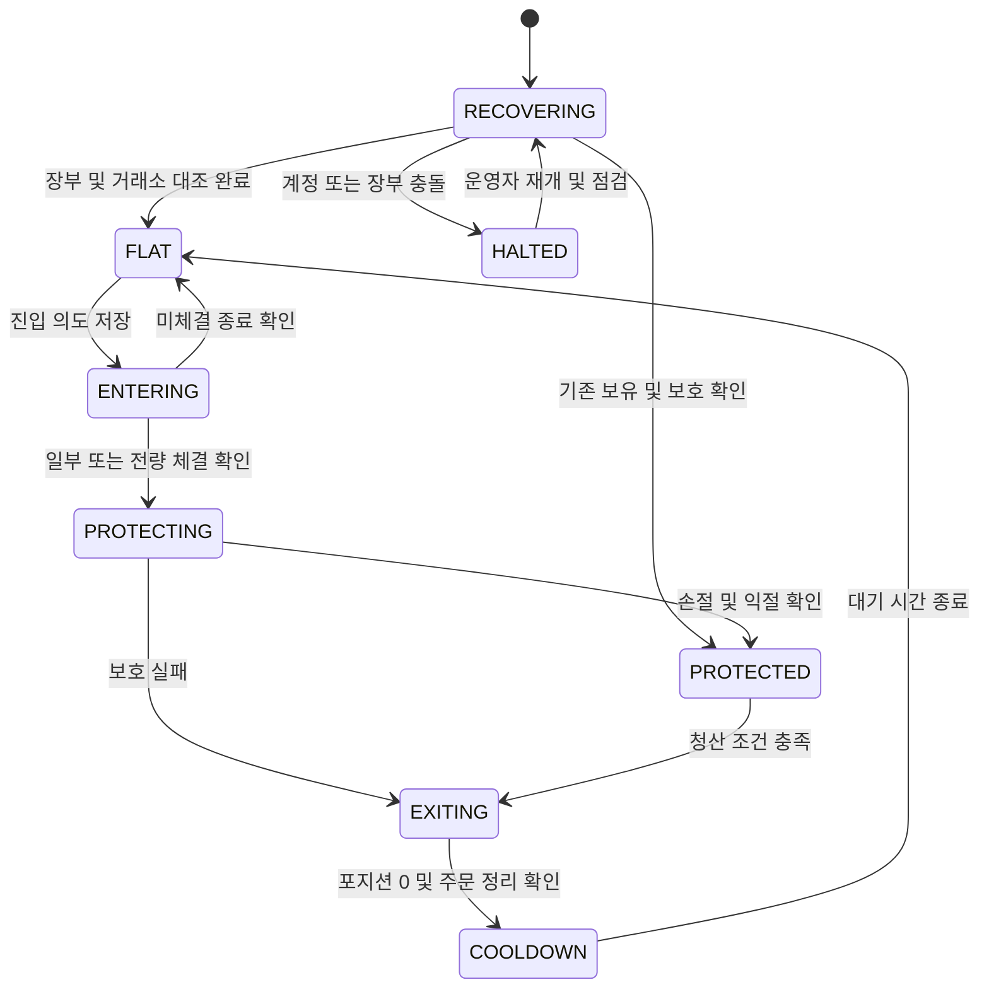
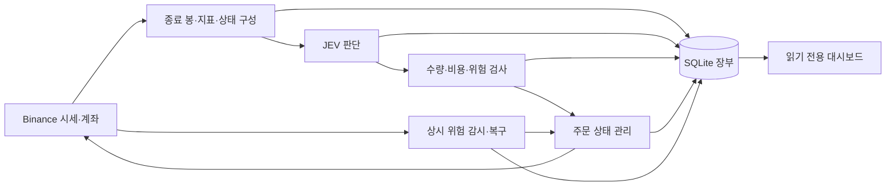

# Binance JEV 자동매매 기획서

작성일: 2026-09-29 · 버전: 0.4 · 상태: 코드 구현, 실운용 검증 전

## 1. 목표와 결정 상태

JEV가 Binance USDT 무기한 선물의 롱·숏 진입과 청산을 판단하는 개인용 자동매매 봇을 만든다. 초기 자금은 약 100만 원이며, 5분마다 판단해 보통 수십 분에서 몇 시간 보유하는 실운용을 목표로 한다. 보호 주문과 계좌 위험 감시는 판단 주기와 독립적으로 작동한다.

**사용자가 확정한 요구사항**

- 초기 운용자금 약 100만 원.
- JEV를 매매 판단에 사용하고 실제 Binance에서 거래.
- 롱과 숏 모두 지원.
- 5분마다 판단하고 수십 분에서 몇 시간 보유하는 방식 선택.
- 24시간 켜 두는 서버에서 운용.

**이 문서에서 제안하는 기본값**

격리 마진, 2배 레버리지, One-way Mode, BTCUSDT·ETHUSDT 관찰, 전체 봇에서 포지션 1개, 아래 손실 한도와 전략 파라미터, Linux·Docker 배포 구성. 이 값들은 사용자에게 확정받은 요구사항이나 수익성이 입증된 설정으로 취급하지 않는다. 검증 후 변경할 때 전략 버전을 올리고 변경 이유를 남긴다.

초기 버전의 성공 조건은 주문·보호·복구가 설계대로 동작하고, JEV 판단과 비용 반영 손익을 재현할 수 있는 것이다. 수익률 목표를 확정하거나 JEV 확률을 수익 확률로 해석하지 않는다.

## 2. 운용 범위

| 항목 | 제안 설정 |
|---|---|
| 시장 | Binance USDⓈ-M, USDT 증거금, PERPETUAL |
| 종목 | BTCUSDT, ETHUSDT 중 거래 규칙과 자금 조건을 충족하는 종목 |
| 포지션 모드 | One-way; 한 종목의 롱·숏 동시 보유 없음 |
| 증거금/레버리지 | Single-Asset, ISOLATED, 2배 고정 |
| 계정 사용 | 봇 전용 선물 계정 또는 사용 가능한 서브계정; 수동 거래·다른 봇과 혼용하지 않음 |
| 동시 포지션 | 계정 전체 1개; 주문 진행 중에도 추가 진입 차단 |
| 매매 판단 | 확정된 5분봉마다 최대 한 번 |
| 참고 시간대 | 확정된 15분봉·1시간봉 |
| 보유 시간 | 수십 분~몇 시간 목표, 최대 4시간; 최소 보유시간 강제 없음 |
| 추가 진입 | 물타기, 피라미딩, 손실 후 주문 증액 없음 |
| 재진입 대기 | 청산 체결 시각으로부터 5분 이후 처음 도착한 정상 판단 슬롯 |

계정의 모드가 설정과 다르면 시작 점검에서 중단하고 차이를 표시한다. 시작할 때 기존 계정 설정을 자동 변경하거나 다른 거래의 주문을 정리하지 않는다. One-way 모드 변경은 다른 종목에도 영향을 줄 수 있다. [B1]

## 3. 자금과 손실 한도

원화 금액은 사용자 설명용이다. 실제 계산·주문·장부는 USDT와 Decimal을 사용한다. 최초 입금·이체 후 확인한 봇 운용자산을 `E0`로 저장하고, 프로세스를 재시작해도 보존한다. 환율이나 USDT 원화 시세를 매매 루프의 기준으로 사용하지 않는다.

추가 입출금 또는 알 수 없는 거래가 발견되면 신규 진입을 멈춘다. 장부에서 외부 자금 이동과 매매 손익을 구분한 뒤 운영자가 운용자금 변경을 기록해야 재개한다. 입금으로 누적 손실 기록이 사라지지 않는다.

| 항목 | 기준 | 100만 원 시작 시 참고 금액 |
|---|---|---:|
| 주문 크기 계산 자산 `Es` | `min(E0, 현재 운용자산)`; 초기에는 이익 자동 재투자 없음 | 최대 100만 원 |
| 거래당 손실 예산 `R` | `0.005 × Es` | 최대 5,000원 |
| 포지션 명목금액 상한 | `0.50 × Es` | 최대 50만 원 |
| 초기 증거금 상한 | `0.25 × Es`; 실제 가용 증거금·비용 여유도 검사 | 최대 25만 원 |
| 일일 중단선 | 당일 시작 운용자산의 2% 손실 | 첫날 약 2만 원 |
| 실험 누적 중단선 | 최초 `E0` 대비 순손실 10% | 약 10만 원 |

운용자산에는 미실현손익을 포함한다. 일일 기준 시각은 Asia/Seoul 00:00이며 저장 시각은 UTC이다. 매매 수수료와 펀딩은 계좌 장부에 한 번만 반영한다. 외부 자금 이동은 손익에서 제외한다. 슬리피지는 실제 체결가격에 포함되므로 손익에서 다시 차감하지 않는다. JEV·서버 비용은 운영비로 별도 기록해 최종 순성과에 합산한다.

손실 중단선에 도달하면 신규 진입을 차단하고 봇의 진입 주문을 취소한 뒤 현재 포지션 청산을 시도한다. 재개는 수동이며, 재시작·날짜 변경만으로 중단 상태가 해제되지 않는다. 누적 한도에 도달한 실험을 계속하려면 별도 실험 버전과 새 손실 예산을 명시해야 한다. 이 한도는 행동을 시작하는 기준이며 체결 지연·슬리피지로 실제 손실이 초과할 수 있다.

## 4. 데이터와 판단 시점

봉 마감 이벤트를 판단의 시작점으로 사용하되, 거래소 시각과 봉의 종료 시각을 대조한다. 아직 종료되지 않은 5분·15분·1시간 봉을 사용하지 않는다. 중복 이벤트·REST 재조회·재시작에도 같은 슬롯을 다시 거래하지 않는다.

- 초기 지표 준비: 각 시간대의 종료된 봉 300개. 누락·중복·역순을 검사하고 필요한 데이터가 없으면 해당 슬롯을 건너뛴다.
- 지표: EMA20/50, RSI14, ATR14, 직전 20개 봉 평균 대비 거래량, 최근 수익률. 수학 계산은 모두 코드에서 수행한다.
- JEV 입력: 시간대별 추세, 추세 간 일치 여부, RSI 구간, 변동성, 거래량 변화, 비용 부담, 현재 포지션과 보유 시간.
- 숫자와 함께 간결한 영어 범주를 제공한다. 예: EMA20이 EMA50 위/아래, RSI 30 미만/30~70/70 초과, 거래량 배율 0.8 미만/0.8~1.2/1.2 초과. 정확한 숫자 비교를 모델에 맡기지 않는다.
- 호가·스프레드·마크가격·다음 펀딩 시각·계좌 상태는 주문 직전에 다시 확인한다. 종목 규칙과 수수료는 시작 시 및 변경·거절 감지 시 갱신한다.
- 최신 호가가 3초보다 오래됐거나 봉 마감 후 30초 안에 판단을 마치지 못하면 신규 진입을 건너뛴다. 연결 확인 시각과 실제 데이터 시각을 별도로 기록한다.
- 종목별 JEV 호출 제한시간 10초, 동일 슬롯 재시도 최대 1회. 재시도도 전체 30초 유효기간 안에서만 허용한다.

초기 버전은 가격·거래량·비용·포지션 데이터를 사용한다. 뉴스 수집과 뉴스 기반 전략은 후속 실험으로 둔다. JEV에는 거래소 키, 잔액 조회 자격증명, 사용자 식별자를 보내지 않는다. [J2]

## 5. JEV의 역할과 결정 계약

공식 TypeSafe API의 `Choice`로 가능한 행동을 제한한다. 검증 기준 모델은 `jev-1.13.0`으로 고정하며 실제 응답 모델 ID도 저장한다. 지원 종료나 버전 변경은 검증 없는 자동 교체로 처리하지 않는다. 공식 Python SDK를 사용하고 재시도·시간 제한은 위 슬롯 정책에 맞춘다. [J1, J3]

| 포지션 상태 | 허용 행동 | 판단 범위 |
|---|---|---|
| 없음 | `OPEN_LONG`, `OPEN_SHORT`, `WAIT` | 다음 수십 분~몇 시간의 보유를 전제로 진입 여부 선택 |
| 롱 또는 숏 보유 | `KEEP`, `CLOSE` | 현재 포지션의 유지 근거가 남아 있는지 판단 |
| 주문·복구 진행 중 | 모델 결과 기록만 가능 | 주문 상태가 확정될 때까지 새 실행 금지 |

초기 평가용 진입 기준은 선택한 진입 행동의 확률 0.65 이상, 1위와 2위 확률 차이 0.20 이상으로 둔다. `WAIT`가 1위이면 거래하지 않는다. 유지 중 `CLOSE`가 1위이며 확률 0.60 이상이면 청산을 요청한다. 이 값들은 미검증 가설이며 검증 구간에서 조정한 뒤 별도 평가 구간에서는 고정한다.

응답의 전체 확률 분포와 confidence를 저장한다. confidence는 주문 크기에 사용하지 않고 선택 확률과 동일한 수치로 취급하지 않는다. 응답 스키마 오류·누락·시간 초과는 `WAIT` 또는 기존 보호 유지로 처리한다. 손절, 시간 청산, 일일 중단은 JEV 응답을 기다리지 않는다. [J4]

두 종목이 모두 진입 기준을 충족하면 예상 왕복 비용을 손절 거리로 나눈 값이 작은 종목을 선택하고, 동률은 설정된 종목 순서로 결정한다. 종목 간 JEV 확률이 동일하게 보정됐다고 가정해 수익 기대치를 비교하지 않는다. 선택하지 않은 신호도 기록한다.

자유 문장 설명은 JEV 출력으로 요구하지 않는다. 대시보드는 입력 지표, 선택 분포, 적용된 규칙을 보여준다. 별도 설명을 만들더라도 이를 JEV가 생성한 판단 근거로 표시하지 않는다.

## 6. 진입·손절·익절 규칙

### 초기 전략 가설

- 손절 거리: 직전 종료된 5분봉의 `1.5 × ATR14`.
- 거리 비율이 0.35% 미만 또는 2.5% 초과이면 해당 진입을 건너뛴다. 범위에 맞추기 위해 손절을 임의로 줄이거나 늘리지 않는다.
- 익절 거리: 최초 손절 거리의 2배. 이는 비용 차감 전 가격 거리 비율이며 실제 순손익 비율과 다를 수 있다.
- 신규 진입 시 손절 거리 비율이 예상 왕복 비용 비율의 2배 이상이어야 한다.
- 최대 보유 4시간, JEV의 `CLOSE`, 손절, 익절, 계좌 중단 중 먼저 발생한 조건으로 청산한다.
- 초기 버전은 분할 익절·트레일링·손절선 확대 없이 전량 청산한다.

### 수량 계산

`P`를 진입 기준가격, `D`를 코인 1개당 손절 가격 거리, `c`를 예상 총비용 비율로 정의한다. `c`에는 계정의 양방향 taker 수수료, 진입·청산 슬리피지 예상치, 최대 보유기간 안에 예상되는 불리한 펀딩 비용을 넣는다. 슬리피지 초기 추정치는 편도 5bp이며 실제 기록으로 검토한다. 유리한 펀딩은 주문 크기를 키우는 데 쓰지 않는다.

```text
R = Es × 0.005
q_risk = R / (D + P × c)
q_notional = (Es × 0.50) / P
q = 수량 단위에 맞춰 내림(min(q_risk, q_notional, 가용 증거금 한도 수량))
```

수량·가격 단위 반영 후 손실 예산, 명목금액, 증거금, 최소·최대 수량과 최소 주문금액을 다시 검사한다. 최소 금액을 충족하려고 수량을 올리지 않는다. 시장가 청산과 지정가 진입에 해당하는 필터를 각각 검사한다. `pricePrecision`·`quantityPrecision`을 tickSize·stepSize 대신 사용하지 않는다. [B2]

예시: 자금 100만 원, 손실 예산 5,000원, 손절 1%, 예상 총비용 0.12%라면 명목금액은 약 446,429원, 2배 초기 증거금은 약 223,214원이다. 실제 수량 반올림·체결·비용은 이 예시와 달라진다.

### 실행 절차

1. 포지션과 미확정 주문이 없고, 자금·시세·계정 상태가 정상인지 확인한다.
2. 실행 의도와 고유 주문 ID를 영속 저장한 다음 주문을 전송한다.
3. 진입은 최신 매수/매도 호가에서 최대 5bp 범위의 체결을 허용하는 `LIMIT + IOC`를 제안한다. 가격 단위 반영으로 범위를 넘으면 건너뛴다. 시장가로 자동 추격하지 않는다.
4. 실제 체결량·평균 체결가·미체결 취소를 확인한다. 부분 체결은 체결된 수량만 보유하며 그 슬롯에서 추가 진입하지 않는다.
5. 체결을 발견하는 즉시 거래소 손절 주문을 먼저 등록하고 익절 주문을 등록한다. 실제 체결과 반영된 비용이 위험 한도를 넘으면 포지션 축소·청산을 수행한다.
6. 보호 주문은 `STOP_MARKET` / `TAKE_PROFIT_MARKET`, `closePosition=true`, `MARK_PRICE` 기준을 제안한다. quantity·reduceOnly를 함께 보내지 않는다. `priceProtect=false`를 기본으로 두며 마크가격과 계약가격 차이 때문에 발동이 지연되는 옵션을 기본 활성화하지 않는다.
7. 보호 주문은 등록 확인까지 추적한다. 체결을 처음 확인한 시점부터 10초 안에 보호 상태를 확인하지 못하면 비상 청산 절차로 전환한다. 이 시간은 거래소 응답을 보장하는 SLA가 아니다.
8. 정상·비상 청산은 현재 포지션 수량을 다시 조회해 반대 방향 `MARKET + reduceOnly`를 사용한다. 확인되지 않은 청산에 새 주문을 겹쳐 보내지 않는다.
9. 포지션 0을 확인한 뒤 남은 봇의 보호 주문을 취소하고, 일반·조건부 주문이 모두 정리됐는지 확인한다. 정리되지 않은 주문이 있으면 재진입하지 않는다.

일반 주문과 조건부 주문은 각각 `/fapi/v1/order`, `/fapi/v1/algoOrder`를 사용한다. 정상 청산이 끝나기 전에 손절부터 취소하지 않는다. 보호 주문 등록과 진입은 원자적 묶음이 아니므로 체결 후 보호가 등록되기까지의 구간을 별도 지표로 측정해야 한다. 현재 코드는 시장가 청산 수량 필터에 맞지 않는 부분 체결에 대해 `reduceOnly` IOC를 시도하며 잔여 포지션이 있으면 중단한다. [B1]

## 7. 상태 관리와 장애 복구



이 도식의 상태 외에 전역 `entry_blocked`와 중단 사유를 저장한다. 손실 한도·DB 오류·연결 장애가 발생해도 기존 포지션의 보호와 청산 처리는 계속한다. 청산 완료 후 일일/누적 손실 중단 사유가 있으면 COOLDOWN 대신 HALTED로 간다.

| 상황 | 처리 |
|---|---|
| 주문 응답 timeout / 실행 여부 불명인 503 | UNKNOWN으로 저장; 주문 ID, 체결 이벤트, 포지션을 대조. 결과를 확정하기 전 재진입·새 ID 재주문 금지 |
| 손절·익절 등록 실패 또는 발동 거절 | 현재 수량 확인 후 비상 청산 시도, 신규 진입 차단 |
| JEV 오류 | 해당 슬롯 거래 생략; 기존 손절·익절 유지 |
| 시세/계좌 스트림 단절 | 신규 진입 중단, 제한된 REST 조회로 대조·복구; 확인된 보호 주문은 유지 |
| DB 쓰기 실패 | 새 노출 생성 중단; 기존 보호 유지 및 필요 시 위험 축소. 로컬 비상 저널에 결과 기록 |
| 재시작 | 저장된 일일/누적 기준·실행 의도 로드 후 거래소 조회. 새로운 초기자금으로 리셋하지 않음 |
| 알 수 없는 포지션·수동 주문 | 충돌로 표시하고 신규 진입 차단. 소유권을 모르는 주문을 임의 취소하지 않음 |
| 강제 청산·ADL | 장부와 보호 주문을 정리하고 HALTED; 자동 재진입 금지 |

주문 전송 직전에 저장한 실행 의도와 결정적 주문 ID를 함께 사용한다. Binance의 client ID를 영구적인 중복 방지 키로 가정하지 않는다. DB 고유키 `(환경, 전략 버전, 종목, 봉 마감 시각, 행동 단계)`로 중복 실행을 막고, 거래소 결과를 대조한다. [B3]

초기 운영은 주문 실행 프로세스 1개로 제한한다. 계정 단위 잠금이 유효한 실행기만 새 주문을 낼 수 있다. 자동 예비 실행기 전환은 범위에서 제외한다. 현재 코드는 1초 REST 감시를 사용한다. 사용자 데이터 스트림과 이벤트 중복 제거는 후속 구현 항목이다. [B4]

5분 전략 루프와 별개로 위험 감시는 이벤트 수신 시와 1초 타이머에서 수행한다. 가격/계좌 상태를 확인할 수 없을 때 손실이 없다고 가정하지 않는다. 거래소 자체 보호 주문은 봇 연결 상태와 별도로 남아 있도록 구성한다.

## 8. 구성 요소와 기존 코드 활용



Python 3.11 이상, 공식 TypeSafe SDK, Binance REST 어댑터, SQLite 영속 장부와 인증된 읽기 전용 상태 API를 초기 구현에 사용한다. 단일 서버에서 주문 의도와 손실 중단을 로컬 트랜잭션으로 보존하기 위해 MongoDB 제안에서 SQLite로 바꿨다. 라이브·테스트넷·모의거래 설정과 기록은 환경별로 분리한다. 사용자 데이터 스트림과 별도 웹 대시보드는 후속 구현 항목이다. 백테스트와 실시간 실행이 같은 판단 계약·위험 계산을 사용하도록 한다.

`binance_jev`에 독립 패키지를 구현했다. 인접한 `binance_LLM`의 Binance 서명 요청·조건부 주문 형식을 참고했지만 직접 import하지 않는다. 기존 클라이언트의 HTTP 오류 처리·float 수치 처리와 실행기의 모델 추천 레버리지·잔액 비율 수량 계산은 사용하지 않는다. Decimal, UNKNOWN 복구, 고정 레버리지, 손실 예산 계산을 적용한다.

`binance_jev`는 별도 패키지와 설정으로 실행하며 형제 폴더의 `app`을 실행 경로로 직접 import하지 않는다. 최초 구현에서 공통 저장소 전체를 재구성하는 작업은 범위에 넣지 않는다.

### 24시간 서버 운영

24시간 서버 운용은 확정 요구사항이다. 배포 기본안은 Linux 서버 1대의 Docker 단일 실행기이며 로컬 PC는 개발·검증 용도로 둔다. 기존 서버 사용 여부와 OS·사양은 확인 후 반영한다. 클라우드 사업자, 유료 상품, DB의 로컬/외부 배치는 아직 확정하지 않는다.

| 항목 | 운영 설계 |
|---|---|
| 실행 구성 | 주문 실행기 1개, 읽기 전용 대시보드, 영속 장부. 대시보드 재시작이 주문 실행기를 재시작하지 않도록 분리 |
| 서버 부팅 | 서비스 자동 시작 후 반드시 RECOVERING. 포지션·일반 주문·조건부 주문·장부·중단 사유를 대조한 뒤 허용된 상태로 이동 |
| 프로세스 장애 | 재시작 간격을 늘리고 반복 실패 시 신규 진입 차단·알림. 단순 프로세스 생존을 정상 매매 상태로 간주하지 않음 |
| 시각 | OS 시각 동기화 사용, 저장 시각 UTC, 운영 화면 Asia/Seoul. 거래소 시각 차이가 허용 범위를 넘으면 신규 진입 차단 |
| 외부 통신 | Binance·JEV·DB 연결 상태를 구분해 기록. Binance 키에는 필요한 선물 조회·거래 권한만 부여하고 출금 권한은 부여하지 않음 |
| 키 보관 | 서버 비밀 저장소 또는 권한 제한 파일로 주입. 이미지·저장소·로그·백업 일반 파일에 평문 키를 포함하지 않음 |
| 네트워크 접근 | 고정 출구 IP와 Binance API IP 허용 목록을 제안. 대시보드는 기본적으로 localhost에 바인딩하고 SSH 터널 또는 인증된 사설망으로 접근 |
| 저장소 | 거래 장부·실행 의도·손실 기준·중단 상태·비상 저널을 재배포 이후에도 보존. 로그 용량 제한과 디스크 잔여 공간 감시 |
| 백업 | 서버 외부에 암호화된 장부·설정 백업. 복원본은 거래소 최신 상태와 대조하기 전 거래 금지; 소실된 손실 기준·실행 의도는 추정값으로 초기화하지 않음 |
| 장애 알림 | 서버 외부 감시기에 60초마다 상태 신호 전송, 3분 이상 미수신 시 운영 채널에 알림을 제안. 같은 서버의 감시 프로세스만으로 서버 전체 장애를 판단하지 않음 |

현재 외부 상태 신호는 비밀 HTTPS URL에 데이터 없이 요청을 보내는 방식이다. 마지막 계좌 확인 시각과 신규 진입 차단 사유는 로컬 상태 API에서 읽는다. 외부 감시기의 3분 기준은 알림 지연 제안값이며, 3초 시세 유효성 검사나 1초 위험 감시 주기를 대체하지 않는다. 알림 서비스 장애 자체는 장부에 기록한다.

계획된 배포는 신규 진입을 멈춘 뒤 포지션이 정리된 상태에서 진행하는 것을 기본으로 한다. 보유 중 재시작이 필요하면 거래소 보호 주문과 장부의 영속 저장을 먼저 확인하며, 종료 훅에서 보호 주문을 취소하지 않는다. 새 프로세스는 기존 프로세스의 종료와 실행 권한을 확인한 뒤 시작한다. 자동 배포로 주문 실행기가 두 개 동시에 동작하는 구성을 사용하지 않는다.

서버 전체가 꺼져 있으면 JEV 판단·4시간 청산·계좌 손실 감시는 실행할 수 없다. 이미 등록된 거래소 보호 주문 상태는 복구 후 다시 확인한다. 서버 복구 목표와 손실 제한을 동일하게 취급하지 않으며, 확인할 수 없는 상태에서는 신규 진입을 허용하지 않는다.

Synology 동기화 폴더를 실행 잠금이나 라이브 DB 저장소로 사용하지 않는다. 개발 소스 동기화와 서버의 실행 데이터 저장을 분리한다.

## 9. 기록과 운영 화면

각 판단에 입력 스냅샷, 봉 시각, 수집 시각, 모델/프롬프트/전략 버전, 전체 확률, confidence, 호출 시간·토큰·비용, 선택한 행동, 위험 검사 결과와 거래 생략 이유를 저장한다. 각 주문에는 의도·client ID·거래소 ID·부분 체결·실제 수수료·보호 주문 연결을 기록한다.

대시보드의 기본 화면:

- 현재 운용자산, 오늘/누적 순손익, 잔여 손실 예산, 수수료·펀딩·운영비.
- 현재 종목·방향·수량·명목금액·증거금·진입가격·청산가격·손절/익절 상태.
- 최신 JEV 판단과 실제 실행 여부, 생략·중단 이유.
- 시세·계좌·JEV·DB 연결 상태와 마지막 확인 시각, 보호 없는 시간.
- 거래별 순손익, 최대 낙폭, 보유 시간, 롱/숏별 결과, JEV 없는 기준 전략과 비교.

`pause_entries`는 신규 진입만 멈추고 기존 포지션 관리를 유지한다. `flatten_and_halt`는 포지션 정리를 시도한 뒤 중단한다. 초기 버전의 운영 명령은 인증된 서버 CLI로 제공한다. 대시보드는 읽기 전용이다. 외부 알림은 사용자가 지정한 운영 채널을 설정한 뒤 활성화하며, 채널/자격증명은 저장소와 로그에 넣지 않는다.

## 10. 검증과 실운용 진입 기준

**주문 신뢰성 검증:** 롱/숏 각각의 진입·부분 체결·손절·익절·모델 청산·4시간 청산, 주문 응답 유실, 보호 주문 거절, 스트림 재연결, DB 장애, 중복 슬롯, 프로세스 재시작을 시험한다. 확인되지 않은 주문 때문에 새 노출이 생기지 않고, 재시작으로 손실 한도가 초기화되지 않아야 한다.

**서버 운영 검증:** 서버 재부팅 후 자동 시작·RECOVERING 복구, 중단 상태 보존, 두 번째 실행기의 주문 차단, 보유 중 프로세스 종료 후 보호 주문 유지, 디스크/DB 쓰기 실패 시 신규 진입 차단을 확인한다. 테스트 환경에서 상태 신호를 끊어 서버 외부 알림을 확인하고, 백업을 복원한 실행기가 대조 완료 전 주문하지 않는지 검증한다.

**전략 평가:** 최근 120일을 시간 순서대로 설계 60일/조정 30일/최종 평가 30일로 나누고 구간 경계의 최대 4시간 보유 라벨 겹침을 제거한다. 최종 평가 구간을 본 후 파라미터를 바꾸면 새 평가 기간이 필요하다. 미래 봉, 종가 확정 전 지표, 현재 포지션과 불일치한 응답 재사용을 금지한다. 현재 모델로 과거 데이터를 평가하는 실험의 한계도 결과에 명시한다.

현재 정책에 따라 포지션·보유 시간이 달라지므로 다른 정책의 JEV 응답을 그대로 재생해 독립 백테스트라고 부르지 않는다. 응답 캐시는 입력 상태·질문·모델 버전이 모두 같을 때만 재사용한다. 뉴스처럼 역사적 사실을 기억해 맞힐 수 있는 입력은 초기 평가에 넣지 않는다.

시장가/IOC 진입은 관측된 호가와 지연·수수료를 반영한다. 충분한 호가 이력이 없는 봉 기반 평가는 슬리피지 시나리오를 사용한 근사치로 표시한다. 한 봉에서 손절·익절이 모두 닿았고 순서를 알 수 없으면 손절 우선으로 계산한다. 실제 펀딩 시각·금액을 반영한다.

동일 비용·수량·손절 규칙의 단순 EMA 추세 전략과 무거래 기준을 비교한다. 총손익, 최대 낙폭, 거래 수, 비용, 회전율, 롱/숏별 성과, 생략 비율과 모델 분포의 안정성을 보고한다. 사후에 가장 좋은 종목·기간만 골라 전체 성과처럼 표시하지 않는다.

테스트넷에서 주문 신뢰성을 확인하고, 실제 시장 데이터로 최소 24시간 연속 모의운용을 실시한다. 다음 요건을 충족한 빌드를 제한된 실운용의 후보로 삼는다.

1. 양방향 체결·보호·청산과 장애 복구 시나리오가 통과한다.
2. 정상 재시작과 통신 장애 뒤 거래소/장부 상태가 일치한다.
3. 같은 슬롯의 중복 주문과 설명되지 않는 잔여 주문이 없다.
4. 비용 반영 전략 보고서가 있으며 미검증·부정적 결과도 표시한다.
5. 전용 계정, 실제 USDT 운용자금, 손실 한도, 운영 서버와 대응 경로가 설정된다.

테스트넷·24시간 운영 통과는 수익성의 증명이 아니다. 실운용 후보 빌드가 완성된 뒤 실제 주문을 켜는 시점을 별도로 정한다. 이번 구현 작업에는 계좌 연결·키 발급·유료 호출·실주문 실행이 포함되지 않았다.

## 11. 비용과 이후 확정할 운영 설정

공식 가격 $0.042/100만 입력 토큰과 무료 출력 기준으로, 2종목 × 하루 288슬롯 × 요청당 입력 2,000토큰 × 30일은 약 $1.45이다. 재시도·추가 질문·검증 호출은 별도다. 같은 가정에서 두 종목의 120일 평가를 매 슬롯 호출하면 약 $5.81이며 입력 크기에 따라 달라진다. 이는 견적 계산이며 실제 유료 호출을 수행한 결과가 아니다. [J1]

거래 수수료·펀딩·슬리피지·서버·DB 비용은 별도다. 100만 원 대비 비용 비율을 대시보드에서 보여준다.

제안한 위험 한도와 매매 파라미터는 구현했지만 실계좌 검증으로 확정된 전략 값은 아니다. 24시간 서버 운용은 확정했고, 기존 서버 사용 여부·OS·사양·고정 출구 IP는 다음 운영 설정으로 남아 있다. SQLite 장부는 서버 로컬 영속 볼륨에 두고 서버 외부에 암호화 백업한다. 배포 단계에서는 전용 Binance 선물 계정, 실제 USDT 입금액, 개인 운영 알림 수신 경로와 서버 외부 감시기를 설정한다. 자격증명은 그 단계에서 권한 제한 파일/비밀 저장소로 주입한다. 서버·감시 비용은 상품을 선정한 뒤 월 비용으로 산정하며 초기 운용자금 100만 원과 구분한다.

### 현재 구현의 검증 범위

코드 단위 테스트는 지표, 위험 수량, JEV 응답 게이트, Binance 요청 형식, 주문 의도/복구, 모의 보호 주문, 운영 명령을 확인한다. 공식 SDK 0.7.1의 설치와 메서드 서명을 확인했다. 서버 밖 감시 서비스의 HTTPS 핑 URL로 60초마다 신호를 보내는 코드를 작성했으며 실제 알림 서비스 설정은 남아 있다. 장부의 환경 고정, 계정 이체·허용하지 않은 수입 감지, 미확정 체결의 지연 복구, 청산 수량 필터 대체 경로를 구현했다. 아직 TypeSafe 실호출, Binance 테스트넷 체결/사용자 스트림, 24시간 모의운용, 입출금과 거래소 수수료·펀딩의 전체 장부 대조, 역사적 백테스트는 완료하지 않았다. 따라서 `live` 실행 설정이 있어도 현재 빌드를 실운용 검증 완료 상태로 표시하지 않는다.

## 12. 근거 자료

아래 공식 문서를 2026-09-29 기준으로 확인했다. 수치·매매 규칙은 이 기획의 실험 가설이며 공급사가 추천한 수익 전략이 아니다.

- [J1 — TypeSafe 모델·가격·모델 버전](https://docs.typesafe.ai/models)
- [J2 — JEV 1.13의 수치 계산·입력·논리 관련 한계](https://docs.typesafe.ai/model-jaggedness/jev-1.13)
- [J3 — TypeSafe API](https://docs.typesafe.ai/api)
- [J4 — TypeSafe confidence의 의미](https://docs.typesafe.ai/confidence)
- [B1 — Binance 일반·조건부 주문, 포지션·마진 모드](https://developers.binance.com/en/docs/catalog/core-trading-derivatives-trading-usd-s-m-futures/api/rest-api/trade)
- [B2 — Binance 거래 규칙·시장 데이터](https://developers.binance.com/en/docs/catalog/core-trading-derivatives-trading-usd-s-m-futures/api/rest-api/market-data)
- [B3 — Binance 응답 불명·재시도·테스트 환경](https://developers.binance.com/en/docs/products/derivatives-trading-usds-futures/general-info)
- [B4 — Binance 사용자 스트림·주문 및 계좌 이벤트](https://developers.binance.com/en/docs/products/derivatives-trading-usds-futures/user-data-streams)
